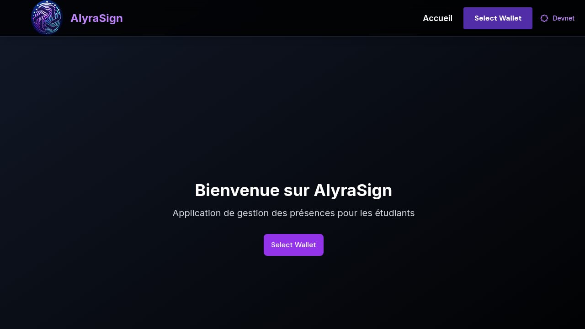
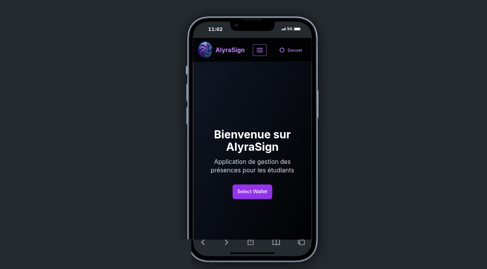

⚠️ 🚨 ATTENTION 🚨 ⚠️ 

Ce projet est actuellement en cours de développement.
Il s'agit d'un prototype réalisé dans le cadre d'une présentation de fin de formation.
Certaines fonctionnalités peuvent ne pas être entièrement implémentées ou fonctionnelles.


# AlyraSign

AlyraSign est un projet d'étude réalisé dans le cadre d'une formation dispensée par << Alyra l'école de l'innovation >> (https://www.alyra.fr).

## Authors

* Yannick Jesson

* Mickaël Girondeau

* Gabriel Forestier

## Responsive App

### Version Desktop


### Version Mobile



## Description

AlyraSign a pour objectif d'enregistrer la présence de participants à des évènements, en utilisant la blockchain Solana.
Les exemples sont nombreux : étudiants assistant à des formations, actionnaires lors d'une assemblée générale, etc.

A chaque évènement sont reliés :
* des participants autorisés
* une ou plusieurs sessions qui ont lieu à différentes dates

Les participants doivent pouvoir signer numériquement la feuille de présence lors d'une session.

## Structure du Programme

### Architecture Générale
Le programme est une application web décentralisée (dApp) construite sur Solana, utilisant Next.js pour le frontend et un programme Solana pour la logique métier.

### Structure des Dossiers
```
alyrasign_prototype/
├── src/
│   ├── app/                  # Pages Next.js
│   │   ├── admin/            # Pages d'administration
│   │   ├── etudiant/         # Pages étudiant
│   │   └── formateur/        # Pages formateur
│   ├── components/           # Composants React
│   │   ├── admin/            # Composants d'administration
│   │   ├── layout/           # Composants de mise en page
│   │   └── formations/       # Composants liés aux formations
│   ├── hooks/                # Hooks personnalisés
│   ├── lib/                  # Utilitaires et configurations
│   └── types/                # Types TypeScript
└── program/                  # Programme Solana
```

## Pages Principales

### 1. Pages d'Administration
- `/admin` : Dashboard administrateur
  - Liste des wallets autorisés
  - État du programme et des PDAs
  - Statistiques réseau

- `/admin/formations` : Gestion des formations
  - Création/modification de formations
  - Gestion des sessions
  - Liste des formations

- `/admin/etudiants` : Gestion des étudiants
  - Ajout d'étudiants
  - Modification des informations des étudiants
  - Suppression d'étudiants
  - Synchronisation des étudiants

### 2. Pages Étudiant
- `/etudiant` : Dashboard étudiant
  - Formations disponibles
  - Formations inscrites
  - Historique des sessions

## Système de Program ID et PDA

### Program ID
- Le Program ID est l'identifiant unique du programme Solana
- Il est stocké dans les variables d'environnement :
  ```
  NEXT_PUBLIC_SOLANA_PROGRAM_ID=votre_program_id
  ```
- Valeur par défaut : `DEFAULT_PROGRAM_ID` si non défini

### PDAs (Program Derived Addresses)

#### 1. Formation PDA
- Seeds : `['formation', formation_id]`
- Propriétaire : Programme
- Stockage :
  - Titre de la formation
  - Description
  - Dates
  - Liste des sessions

#### 2. Session PDA
- Seeds : `['session', session_id, formation_id]`
- Propriétaire : Programme
- Stockage :
  - Titre de la session
  - Description
  - Date et heure
  - Liste des participants

#### 3. Inscription PDA
- Seeds : `['inscription', student_address, formation_id]`
- Propriétaire : Programme
- Stockage :
  - Statut de l'inscription
  - Date d'inscription

## Gestion des Formations

### 1. Création d'une Formation
- L'administrateur crée une formation avec :
  - Titre
  - Description
  - Date de début
  - Date de fin

### 2. Gestion des Sessions
- L'administrateur peut créer des sessions pour chaque formation :
  - Titre
  - Description
  - Date
  - Heure de début
  - Heure de fin

### 3. Marquage de Présence
- L'étudiant peut marquer sa présence pour chaque session
- Le formateur peut valider les présences

## Gestion des Rent et Frais

### 1. Modèle de Paiement
- Le wallet connecté (admin ou formateur) paie tous les rent et frais du programme
- Les étudiants ne paient que les frais de transaction pour leurs actions spécifiques

### 2. Implémentation Technique
- Le hook `useAdminTransaction` gère les transactions administratives :
  - Calcul du rent minimum pour les PDAs via `calculateRentExemption`
  - Vérification que l'utilisateur est administrateur avant d'autoriser les opérations
  - Envoi des transactions via le wallet connecté

- Le hook `useBlockchain` gère toutes les interactions avec la blockchain :
  - Création de formations, sessions, inscriptions
  - Enregistrement des étudiants
  - Marquage des présences
  - Toutes les transactions sont signées par le wallet connecté

### 3. Répartition des Coûts
- **Administrateur** : Paie les rent pour les PDAs de formations, sessions et inscriptions
- **Formateur** : Peut payer les rent pour les formations et sessions qu'il crée
- **Étudiant** : Paie uniquement les frais de transaction pour marquer sa présence

## Gestion du Wallet Admin

### 1. Configuration Centralisée
- L'adresse du wallet admin est centralisée dans le fichier `.env` :
  ```
  NEXT_PUBLIC_ADMIN_WALLET="votre_adresse_admin"
  ```
- Cette variable est utilisée dans tout le code pour vérifier les permissions d'administration

- Dupliquez le fichier `.env.example` en `.env` et remplacez les valeurs demandées :
  ```
  # Wallet admin prédéfini
  NEXT_PUBLIC_ADMIN_WALLET="votre_adresse_wallet_admin"
  NEXT_PUBLIC_ADMIN_WALLET_1="votre_adresse_wallet_admin_1"
  NEXT_PUBLIC_ADMIN_WALLET_2="votre_adresse_wallet_admin_2"

  # Program IDs pour le développement devnet
  NEXT_PUBLIC_ALYRA_SIGN_PROGRAM_ID="votre_program_id"
  NEXT_PUBLIC_ALYRA_SIGN_REGISTRY_PROGRAM_ID="votre_registry_program_id"
  NEXT_PUBLIC_ALYRA_SIGN_PRESENCE_PROGRAM_ID="votre_presence_program_id"
  ```

### 2. Procédure de Changement d'Admin
Pour changer l'adresse du wallet admin :
1. Ouvrir le fichier `.env` à la racine du projet
2. Modifier la valeur de `NEXT_PUBLIC_ADMIN_WALLET` avec la nouvelle adresse
3. Redémarrer l'application pour que les changements prennent effet

### 3. Implémentation Technique
- Le code utilise un pattern de fallback pour garantir la robustesse :
  ```typescript
  const DEV_ADDRESS = process.env.NEXT_PUBLIC_ADMIN_WALLET || "adresse_par_défaut"
  ```
- Cette approche se trouve dans trois fichiers principaux :
  - `src/app/admin/page.tsx` : Pour l'accès à la page d'administration
  - `src/hooks/useAdminTransaction.ts` : Pour les transactions admin
  - `src/components/layout/AppBar.tsx` : Pour l'affichage des éléments d'interface admin

### 4. Avantages de cette Approche
- **Simplicité** : Un seul endroit à modifier pour changer l'admin
- **Sécurité** : Configuration séparée du code
- **Flexibilité** : Différentes adresses admin possibles pour différents environnements
- **Robustesse** : Valeur par défaut en cas d'absence de configuration

## Fonctions Principales

### 1. Gestion des Formations
```typescript
createFormation(data: FormationData)
updateFormation(formationId: string, data: FormationData)
deleteFormation(formationId: string)
```

### 2. Gestion des Sessions
```typescript
createSession(formationId: string, data: SessionData)
updateSession(sessionId: string, data: SessionData)
deleteSession(sessionId: string)
```

### 3. Gestion des Inscriptions
```typescript
inscrireEtudiant(studentAddress: string, formationId: string)
annulerInscription(inscriptionId: string)
```

### 4. Gestion des Présences
```typescript
marquerPresence(sessionId: string, studentAddress: string)
validerPresence(sessionId: string, studentAddress: string)
```

### Caractéristiques Communes

- Utilisation d'Anchor Framework (v0.27.0)
- Compatible avec Solana v1.18.2
- Gestion des erreurs via `ErrorCode` enum
- Utilisation de seeds pour la dérivation des PDAs
- Validation des données d'entrée
- Timestamps automatiques pour la création des comptes
- Gestion des compteurs (formation_count, student_count, etc.)
- Vérification des autorités pour les opérations sensibles


## Architecture des Smart Contracts

### Méthode Actuelle de Déploiement
- Utilisation du framework Anchor pour Solana
- Smart contracts écrits en Rust
- Déploiement via la commande `anchor deploy`
- Programmes déployés sur le réseau devnet
- Trois programmes principaux :
  - `alyra_sign` (ID: v69C2KjiWjhUcRTKuotEY1E1PykP4oUtFaBE8ZCg5yJ)
  - `alyra_sign_registry` (ID: 3vbwWQNTZszFpr4AGcPqJ7ATuJem2MBjZWsDTTYKjKbG)
  - `alyra_sign_presence` (ID: 4kYH3a5GM9Y7oLJjEhdYSFc6hmvgihfvXaCQij3AZ1J8)

### Structure des Programmes
- Chaque programme possède ses propres instructions et comptes
- Utilisation de PDAs (Program Derived Addresses) pour la gestion des comptes
- Instructions sécurisées avec vérifications de signataires et d'autorité

### Alternatives Possibles

**1. Utilisation de SPL (Solana Program Library)**
- Implémentation de tokens SPL pour la gestion des présences
- Avantages : Standardisation, meilleure interopérabilité
- Inconvénients : Complexité accrue pour un cas d'usage simple

**2. Programme Unique avec CPI (Cross-Program Invocation)**
- Fusion des trois programmes en un seul
- Utilisation de CPI pour les interactions
- Avantages : Simplification de l'architecture, réduction des coûts
- Inconvénients : Moins de modularité

**3. Utilisation de Metaplex**
- Intégration des standards Metaplex pour les métadonnées
- Avantages : Meilleure gestion des métadonnées, standards établis
- Inconvénients : Surcharge potentielle pour des besoins simples

**4. Programme avec Comptes Optimisés**
- Optimisation de la taille des comptes
- Structures de données plus efficaces
- Avantages : Réduction des coûts de stockage
- Inconvénients : Complexité accrue du code

### Recommandations

**Court Terme**
- Maintenir l'architecture actuelle
- Optimiser les tailles de comptes existants
- Ajouter des tests plus complets

**Moyen Terme**
- Fusion de `alyra_sign` et `alyra_sign_presence`
- Conservation de `alyra_sign_registry` séparé
- Implémentation de mécanismes de mise à jour

**Long Terme**
- Évaluation de SPL pour les tokens de présence
- Intégration des standards Metaplex
- Système de mise à jour automatique

## Dépendances

```
solana-cli : 1.18.2
anchor-cli : 0.27.0
nvm : 0.39.3
node : v23.10.0
avm : 0.31.0
rustc : 1.72.0
cargo : 1.72.0
```

## WEB DEBUG - Simulateur mobile

Simulateur de smartphone et tablette sur ordinateur très réaliste avec plusieurs modèles disponibles pour tester son site mobile.

https://www.webmobilefirst.com/

